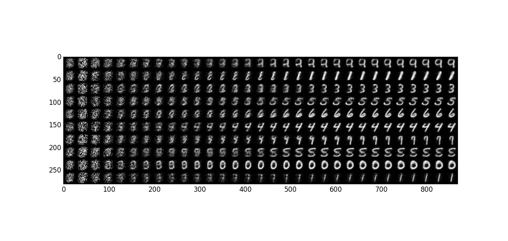

## Learning to Generate Samples from Noise Through Infusion Training
Reproducing an experiment from the ICLR 2017 submission by Bordes et al. from MILA.

### How to run
Currently, only the MNIST experiments are available.

```[bash]
> python3 infusion.py -t d -s 15 --lr 1e-3 -a 0.01 -e 200
```

would give you the following generation after 30 epochs of training.

It is nice to see that all the numbers are generated, but it is not known whether it has the same "mode avoiding" problem as GAN.



### Observations
The training is robust (in that not much tuning is required) but not very stable.
Occasionally the loss will rise suddenly, and the model will generate artifacts.
The cause of the problem is yet unknown.

Also, the generator tends to generate `8` that look like `1`.

### Problems
Since the std is small during training, can we train a model without the std at all? 
> The determinstic version of the model tries to answer the problem.
